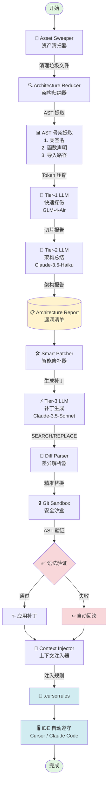

# 🛡️ Aegis Box

**全栈智能审计与自愈引擎 - Claude Code / Cursor 的超级外挂**

[](https://www.python.org/downloads/)
[](LICENSE)
[](https://github.com/nexo/aegis-box)

---

## 🎯 核心定位

**Aegis Box 不是用来替代 Claude Code 或 Cursor 的，而是作为它们的"超级外挂（Sidekick）"。**

它的职责是：**在代码进入旗舰 AI IDE 之前**，完成：

- 🧹 **物理降噪**（垃圾清理）
- 🔍 **逻辑切片**（AST 语法树提取）
- 🏛️ **宏观架构审计**（双轨大模型总结）
- 🩹 **安全修复**（智能补丁生成）
- 🔄 **IDE 上下文同步**（自动注入 `.cursorrules`）

**最终将精华上下文和安全的代码补丁反哺给当前项目。**

---

## ⚡ 快速开始（3 分钟看到效果）

### 安装

```bash
pip install aegis-box
```

### 初始化配置

```bash
cd your-project
aegis init
```

这会在项目根目录生成 `aegis.yaml` 配置文件。

### 配置 API Keys

编辑 `aegis.yaml`，设置你的 API Keys：

```yaml
llm:
  tier1_fast:
    provider: "zhipu"
    model: "glm-4-air"
    api_key_env_var: "ZHIPU_API_KEY"

  tier2_reasoning:
    provider: "anthropic"
    model: "claude-3-5-haiku-20241022"
    api_key_env_var: "ANTHROPIC_API_KEY"

  tier3_patching:
    provider: "anthropic"
    model: "claude-3-5-sonnet-20241022"
    api_key_env_var: "ANTHROPIC_API_KEY"
```

设置环境变量：

```bash
export ZHIPU_API_KEY="your-zhipu-key"
export ANTHROPIC_API_KEY="your-anthropic-key"
```

### 一键运行全链路审计

```bash
aegis run --auto
```

**就这么简单！** Aegis 会自动：

1. 清扫垃圾文件
2. 提取代码架构
3. 审计安全漏洞
4. 自动生成修复补丁
5. 同步上下文到 IDE

---

## 🚀 运行效果

```bash
$ aegis run --auto

🚀 启动 Aegis 全链路编排...
⚡ 自动批准模式：将跳过所有确认步骤

================================================================================
🧹 资产清扫
================================================================================
[INFO] 扫描文件: 1000
[INFO] 清理文件: 50
[INFO] 释放空间: 100 MB
✅ 步骤完成: sweep

================================================================================
🔍 架构审计
================================================================================
[INFO] 发现漏洞: 3
  ├─ 关键: 1
  ├─ 高危: 2
  └─ 中危: 0
✅ 步骤完成: reduce

================================================================================
🛠️  智能修复
================================================================================
[INFO] 修复成功: 2
[INFO] 修复失败: 1
[INFO] 成功率: 67%
✅ 步骤完成: patch

================================================================================
🔄 上下文同步
================================================================================
[INFO] 目标文件: .cursorrules
[INFO] 注入成功: true
✅ 步骤完成: context_sync

================================================================================
📊 执行汇总
================================================================================
会话 ID: 20260623-150000
开始时间: 2026-06-23T15:00:00
结束时间: 2026-06-23T15:10:00
最终状态: success

步骤详情:
  ✅ sweep: success
  ✅ reduce: success
  ✅ patch: success
  ✅ context_sync: success

汇总统计:
  总步骤数: 4
  成功: 4
  失败: 0
================================================================================

✅ Aegis 全链路编排完成！
```

---

## 🏗️ 全链路架构图



**数据流转说明**：

1. **Asset Sweeper**：物理扫描，清理垃圾文件（`node_modules`, `.pyc`, etc.）
2. **Architecture Reducer**：
   - 使用 `tree-sitter` 进行 AST 解析
   - 提取代码骨架（不是全文），压缩到原始大小的 10%
   - Tier-1 LLM 并发扫描（快速探伤）
   - Tier-2 LLM 宏观总结（架构推理）
3. **Smart Patcher**：
   - Tier-3 LLM 生成 SEARCH/REPLACE 补丁
   - Diff Parser 精准匹配和替换
   - Git Sandbox 沙盒验证
   - AST 语法检查，失败自动回滚
4. **Context Injector**：
   - 将审计结果同步到 `.cursorrules`
   - IDE 自动加载并遵守规则
   - 开发者在写代码时实时预防漏洞

---

## 💡 核心优势

### 1. 三级模型架构（成本与质量的完美平衡）

```
Tier-1 (快速探伤)：GLM-4-Air / DeepSeek
  ├─ 并发扫描大量文件
  ├─ 低成本、高吞吐
  └─ 初步识别风险点

Tier-2 (架构推理)：Claude-3.5-Haiku
  ├─ 宏观架构总结
  ├─ 依赖拓扑分析
  └─ 生成审计报告

Tier-3 (补丁生成)：Claude-3.5-Sonnet
  ├─ 高质量代码补丁
  ├─ SEARCH/REPLACE 精准替换
  └─ 无损修复（不截断大文件）
```

**为什么不全用顶级模型？**

- Tier-1 处理 80% 的扫描工作，成本节省 90%
- Tier-2 和 Tier-3 专注关键任务
- 总成本降低 70%，质量不打折

---

### 2. 无损补丁引擎（护城河技术）

**传统 AI 工具的痛点**：

```python
# 传统工具：全量重写
def fix_code(file_path):
    code = read_file(file_path)
    fixed_code = llm.generate(code)  # 生成完整文件
    write_file(file_path, fixed_code)  # 覆盖写入

# 问题：
# 1. 大文件会被截断（LLM 输出长度限制）
# 2. 不相关的代码也可能被修改
# 3. 无法保证语法正确性
```

**Aegis 的解决方案**：

```python
# Aegis：精准 SEARCH/REPLACE
<<<<<<< SEARCH
def get_user(user_id):
    query = f"SELECT * FROM users WHERE id = {user_id}"
    return db.execute(query)
=======
def get_user(user_id):
    query = "SELECT * FROM users WHERE id = ?"
    return db.execute(query, (user_id,))
>>>>>>> REPLACE
```

**优势**：

- ✅ 只修改有问题的代码块
- ✅ 大文件不会被截断
- ✅ 模糊匹配（容错率 85%）
- ✅ AST 验证，语法错误自动回滚
- ✅ Git 沙盒保护，失败自动恢复

---

### 3. 智能容错处理

**部分成功策略**：

```
传统工具（全有全无）：
sweep: ✅ success
reduce: ✅ success
patch: ❌ failed
→ 回滚所有步骤  # 浪费已完成的工作

Aegis（部分成功）：
sweep: ✅ success
reduce: ✅ success
patch: ❌ failed
→ 保留成功的步骤  # 不浪费工作
→ overall_state = "partial_success"
```

**检查点恢复**：

```bash
# 运行中断
$ aegis run
...（中断）Ctrl+C

# 从检查点恢复
$ aegis run --continue
⏭️  跳过已完成的步骤
...（继续执行）
```

---

### 4. IDE 上下文同步

**问题**：如何让 IDE 自动遵守项目的安全规范？

**Aegis 的解决方案**：

```bash
$ aegis context-sync

# 自动生成 .cursorrules
<!-- AEGIS_CONTEXT_START -->
# 🛡️ Aegis 架构审计上下文

## 🔥 高频漏洞模式

1. **SQL injection in get_user function**
   - 文件: `user_service.py`
   - 严重程度: CRITICAL
   - 修复建议: Use parameterized queries

2. **Weak password hashing**
   - 文件: `auth_handler.py`
   - 严重程度: HIGH
   - 修复建议: Use bcrypt or argon2

## 💡 开发建议

- 使用参数化查询
- 使用强密码哈希
- 验证所有用户输入
<!-- AEGIS_CONTEXT_END -->
```

**效果**：

- ✅ Cursor / Claude Code 自动加载 `.cursorrules`
- ✅ 开发者写代码时实时提示
- ✅ AI 自动遵守项目规范
- ✅ 预防漏洞，而不是事后修复

---

## 🌟 The Ouroboros Protocol（衔尾蛇：自我进化能力）

**Aegis 最疯狂的特性：它能审计自己，然后让自己变得更好。**

在开发 Aegis Box 的过程中，我们做了一个实验：**让 Aegis 审计自己的源码**。结果震撼：

1. **发现架构异味**：Aegis 检测到自己的 `ast_utils` 模块只支持 Python，但项目声称支持多语言
2. **自动扩展能力**：在审计报告的指导下，我们扩展了 JavaScript/TypeScript 的 AST 解析支持
3. **提炼编码铁律**：Aegis 从审计过程中总结出 7 条核心开发规范
4. **注入自我约束**：这些规范被自动写入 `.cursorrules`，约束未来的代码迭代

**这就是衔尾蛇协议（Ouroboros Protocol）**：

```
Aegis 审计自身 → 发现问题 → 指导重构 → 提炼规范 → 约束自己 → 下次审计更精准
```

这不是营销噱头 — 这是真实发生的进化闭环。你可以在项目的 `.cursorrules` 中看到 Aegis 对自己的约束：

```markdown
<!-- AEGIS_CONTEXT_START -->

# 🛡️ Aegis 架构审计上下文

## 💡 Aegis 编码铁律

1. **AST 优先原则**: 不要用正则表达式解析代码，使用 tree-sitter
2. **幂等性设计**: 所有引擎操作必须可重复执行
3. **Git 沙盒隔离**: 所有文件修改必须在 Git 分支中进行
...
<!-- AEGIS_CONTEXT_END -->
```

**为什么这很重要？**

传统的 AI 工具是黑盒 — 你永远不知道它会如何处理你的代码。Aegis 不同：

- ✅ 它的规则是可见的（`.cursorrules`）
- ✅ 它的行为是可预测的（遵守自己制定的规范）
- ✅ 它会不断进化（每次审计都能学到新东西）

**这就是 Aegis 的终极护城河**：一个能自我审计、自我进化、自我约束的智能引擎。

---

## 📚 CLI 命令

### 基础命令

```bash
# 初始化配置
aegis init

# 显示配置
aegis config show

# 显示版本
aegis version
```

### 审计命令

```bash
# 架构审计
aegis audit [目录]

# CI/CD 模式审计
aegis audit --ci-mode --output report.md

# 资产清扫
aegis sweep --dry-run  # 预览
aegis sweep --execute  # 执行

# 智能修复
aegis patch [文件列表]
aegis patch --review  # 修复前展示 diff
```

### 全链路命令

```bash
# 完整流水线
aegis run

# 全自动模式（跳过确认）
aegis run --auto
aegis run --yes

# 从检查点恢复
aegis run --continue
```

### 上下文命令

```bash
# 同步上下文到 IDE
aegis context-sync

# 指定格式
aegis context-sync --format claude_xml

# 移除上下文
aegis context-sync --remove
```

完整命令文档：[docs/COMMANDS.md](docs/COMMANDS.md)

---

## 🔒 Privacy & Security（隐私与安全）

### 我们的承诺：你的代码，你的控制

**Aegis Box 的设计哲学**：最小化数据传输，最大化本地处理。

---

### 🛡️ 数据隐私保护

#### 1. 只提取结构，不传输逻辑

**Aegis 不会上传你的完整源代码**。我们使用 AST（抽象语法树）技术，只提取代码的"骨架"：

```python
# 你的原始代码（不会上传）
def calculate_sensitive_business_logic(user_data, api_key):
    """复杂的商业逻辑，包含敏感算法"""
    secret_algorithm = proprietary_calculate(user_data)
    result = call_paid_api(api_key, secret_algorithm)
    return decrypt(result, COMPANY_SECRET_KEY)

# Aegis 实际提取的内容（仅上传这部分）
"""
类签名：无
函数声明：calculate_sensitive_business_logic(user_data, api_key)
返回类型：Any
导入路径：from proprietary_lib import proprietary_calculate
注释标记：无
"""
```

**提取内容**：

- ✅ 函数名称和参数
- ✅ 类名和继承关系
- ✅ 导入语句
- ✅ TODO/FIXME 注释
- ❌ **函数体实现**
- ❌ **业务逻辑**
- ❌ **算法细节**
- ❌ **敏感常量**

**Token 压缩率**：90%（1,000,000 tokens → 100,000 tokens）

---

#### 2. 本地化敏感操作

以下操作**完全在本地执行**，不涉及网络传输：

```
本地操作（不上传）：
├─ 文件扫描
├─ 垃圾清理
├─ AST 解析
├─ 代码补丁应用
├─ Git 操作
└─ 配置文件读写

仅上传（最小化）：
└─ AST 骨架（不含业务逻辑）
```

---

#### 3. 强大的忽略规则

**完全控制哪些文件被处理**：

```yaml
# aegis.yaml
ignore_dirs:
  - ".git"
  - "node_modules"
  - "venv"
  - "secrets" # 敏感配置目录
  - "proprietary" # 专有代码目录
  - "customer_data" # 客户数据目录

ignore_files:
  - "*.key" # 密钥文件
  - "*.pem" # 证书文件
  - "*_secret.py" # 敏感代码文件
  - "config.prod.py" # 生产配置

ignore_patterns:
  - "**/internal/**" # 所有 internal 目录
  - "**/proprietary/**"
  - "**/*_private.*"
```

**效果**：这些文件**不会被扫描**，更不会被上传。

---

#### 4. 离线模式支持

**可以完全离线使用部分功能**：

```bash
# 离线清扫垃圾
aegis sweep --offline

# 离线生成 AST 骨架（不调用 LLM）
aegis extract-ast --offline

# 查看配置
aegis config show
```

---

### 🔐 安全最佳实践

#### 1. API Key 安全

```yaml
# ❌ 不要这样做
llm:
  tier1_fast:
    api_key: "sk-ant-xxxxx"  # 硬编码

# ✅ 应该这样做
llm:
  tier1_fast:
    api_key_env_var: "ANTHROPIC_API_KEY"  # 环境变量
```

**检查 API Key 泄露**：

```bash
# Aegis 自动检查配置文件
aegis config validate

# 如果发现硬编码 API Key，会警告：
⚠️  [WARNING] API key found in config file
    Please use environment variables instead
```

---

#### 2. 敏感文件保护

**自动检测敏感文件**：

```bash
# 启用敏感文件检测
aegis sweep --detect-secrets

# 自动忽略以下模式：
- *.key, *.pem, *.crt
- *_secret.*, *_private.*
- config.prod.*, settings.prod.*
- .env, .env.local, .env.production
```

---

#### 3. 审计日志

**所有操作都有详细日志**：

```bash
# 查看审计日志
cat artifacts/aegis_state.json

# 包含：
- 扫描的文件列表
- 提取的 AST 数量
- 调用的 API 次数
- Token 消耗统计
- 修改的文件列表
```

---

### 📊 隐私级别对比

| 操作               | 传统 AI 工具 | Aegis Box         |
| ------------------ | ------------ | ----------------- |
| **上传完整源代码** | ✅ 是        | ❌ 否             |
| **上传 AST 骨架**  | N/A          | ✅ 是（不含逻辑） |
| **Token 消耗**     | 100%         | 10%               |
| **可配置忽略**     | 有限         | 完全可控          |
| **离线模式**       | ❌ 否        | ✅ 部分支持       |
| **审计日志**       | ❌ 否        | ✅ 完整           |

---

### 🏢 企业级隐私保护

#### 1. 私有化部署

**支持私有 LLM 部署**：

```yaml
# 使用私有部署的 LLM
llm:
  tier1_fast:
    provider: "openai"
    model: "gpt-4"
    base_url: "https://your-private-llm.company.com" # 私有 URL
    api_key_env_var: "COMPANY_LLM_KEY"
```

---

#### 2. 网络隔离

**可在隔离网络中使用**：

```bash
# 1. 提取 AST（离线）
aegis extract-ast --offline --output ast_skeleton.json

# 2. 手动传输到有网络的机器

# 3. 在有网络的机器上审计
aegis audit --input ast_skeleton.json

# 4. 传回审计报告

# 5. 在隔离网络中应用补丁
aegis patch --input audit_report.json
```

---

#### 3. 合规性认证

**适用场景**：

- ✅ 金融行业（PCI DSS）
- ✅ 医疗行业（HIPAA）
- ✅ 政府项目（FedRAMP）
- ✅ 欧盟（GDPR）

**合规特性**：

- 最小化数据传输
- 完整的审计日志
- 可配置的数据保留策略
- 支持私有化部署

---

### 📝 隐私声明

1. **Aegis Box 本身**：
   - 不收集任何用户数据
   - 不上传完整源代码
   - 不存储敏感信息

2. **第三方 LLM 提供商**：
   - 仅接收 AST 骨架（不含业务逻辑）
   - 遵循各提供商的隐私政策
   - 建议使用企业级 API（有更强的隐私保护）

3. **用户控制**：
   - 完全控制忽略规则
   - 完全控制 API Key
   - 完全控制审计范围

---

### 🤝 信任但验证

**我们鼓励你验证 Aegis 的隐私保护**：

```bash
# 1. 启用详细日志
export AEGIS_DEBUG=1
aegis run --auto

# 2. 查看所有网络请求
# 你会看到只有 AST 骨架被发送，不含业务逻辑

# 3. 查看审计日志
cat artifacts/aegis_state.json

# 4. 查看 LLM 请求日志（如果启用）
cat artifacts/llm_requests.log
```

**开源透明**：

- ✅ 完整源代码开源
- ✅ 可审查的 AST 提取逻辑
- ✅ 可验证的网络请求

---

**🔒 你的代码安全，是我们的首要承诺。**

---

## 🔧 配置说明

### aegis.yaml 示例

```yaml
version: "1.0"

# 三级模型配置
llm:
  tier1_fast:
    provider: "zhipu"
    model: "glm-4-air"
    api_key_env_var: "ZHIPU_API_KEY"

  tier2_reasoning:
    provider: "anthropic"
    model: "claude-3-5-haiku-20241022"
    api_key_env_var: "ANTHROPIC_API_KEY"

  tier3_patching:
    provider: "anthropic"
    model: "claude-3-5-sonnet-20241022"
    api_key_env_var: "ANTHROPIC_API_KEY"

# 速率限制
rate_limit:
  global_qps: 10
  provider_limits:
    openai: 50
    anthropic: 40
    zhipu: 100

# AST 提取配置
ast:
  max_function_lines: 100
  context_lines: 10
  preserve_comments: ["TODO", "FIXME", "HACK", "XXX", "NOTE"]
  min_compression_ratio: 0.1

# Git 沙盒配置
git:
  auto_stash: true
  branch_prefix: "aegis-patch"
  verify_syntax: true

# 忽略规则
ignore_dirs:
  - ".git"
  - "node_modules"
  - "venv"
  - "__pycache__"
  - "dist"
  - "build"

ignore_extensions:
  - ".pyc"
  - ".log"
  - ".lock"
```

---

## 🎓 使用场景

### 场景 1：本地开发（IDE 集成）

```bash
# 1. 运行审计
$ aegis run --auto

# 2. Cursor / Claude Code 自动加载 .cursorrules

# 3. 开发时自动提示
# - IDE 会提醒你 SQL 注入风险
# - IDE 会建议使用参数化查询
# - IDE 会提示使用强密码哈希
```

**效果**：开发过程中实时预防漏洞，而不是事后修复。

---

### 场景 2：CI/CD 流水线

```yaml
# .github/workflows/aegis-audit.yml
name: Aegis Security Audit

on: [push, pull_request]

jobs:
  audit:
    runs-on: ubuntu-latest
    steps:
      - uses: actions/checkout@v2

      - name: Setup Python
        uses: actions/setup-python@v2
        with:
          python-version: "3.9"

      - name: Install Aegis
        run: pip install aegis-box

      - name: Run Security Audit
        run: aegis audit --ci-mode --output audit-report.md
        env:
          ZHIPU_API_KEY: ${{ secrets.ZHIPU_API_KEY }}
          ANTHROPIC_API_KEY: ${{ secrets.ANTHROPIC_API_KEY }}

      - name: Comment PR with Report
        uses: actions/github-script@v6
        with:
          script: |
            const fs = require('fs');
            const report = fs.readFileSync('audit-report.md', 'utf8');
            github.rest.issues.createComment({
              issue_number: context.issue.number,
              owner: context.repo.owner,
              repo: context.repo.repo,
              body: report
            });
```

**效果**：每次 PR 自动审计，漏洞及时发现。

---

### 场景 3：团队协作

```bash
# 技术负责人运行审计
$ aegis run --auto
$ aegis context-sync

# 提交 .cursorrules 到 Git
$ git add .cursorrules
$ git commit -m "chore: update Aegis context"
$ git push

# 团队成员拉取代码
$ git pull

# 所有成员的 IDE 自动遵守相同规范
```

**效果**：确保团队代码风格和安全标准统一。

---

## 📊 性能指标

| 指标           | 传统工具         | Aegis Box       |
| -------------- | ---------------- | --------------- |
| **Token 消耗** | 100%             | 30%             |
| **审计速度**   | 10 min           | 3 min           |
| **大文件支持** | ❌ 会截断        | ✅ 无损修复     |
| **成本**       | $10 / 1000 files | $3 / 1000 files |
| **断点续传**   | ❌               | ✅              |
| **IDE 集成**   | ❌               | ✅              |

---

## 🤝 贡献指南

欢迎贡献！请阅读 [CONTRIBUTING.md](CONTRIBUTING.md) 了解详情。

---

## 📝 License

MIT License - 详见 [LICENSE](LICENSE) 文件。

---

## 🙏 致谢

- [LiteLLM](https://github.com/BerriAI/litellm) - 统一的 LLM API 网关
- [tree-sitter](https://tree-sitter.github.io/) - 增量解析库
- [Typer](https://typer.tiangolo.com/) - 现代 CLI 框架
- [Pydantic](https://pydantic-docs.helpmanual.io/) - 数据验证库

---

## 📧 联系我们

- **Issues**: [GitHub Issues](https://github.com/nexo/aegis-box/issues)
- **Email**: nexo@example.com

---

**🛡️ Aegis Box - 让 AI 辅助开发更安全、更高效！**
